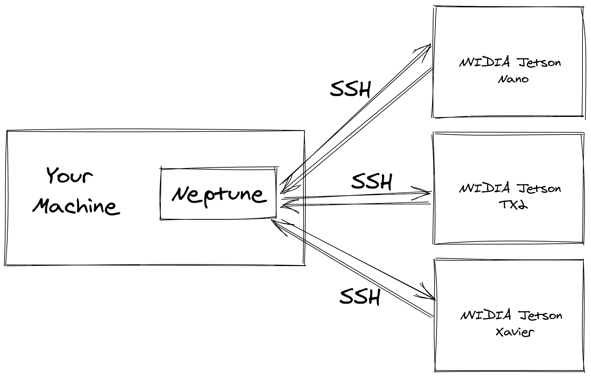

# Neptune



## Prerequisites

1. Install Ansible on your machine (not on the Jetson): [Ubuntu](https://docs.ansible.com/ansible/latest/installation_guide/intro_installation.html#installing-ansible-on-ubuntu) or [macOS](https://docs.ansible.com/ansible/latest/installation_guide/intro_installation.html#installing-ansible-on-macos) or [Python PIP](https://docs.ansible.com/ansible/latest/installation_guide/intro_installation.html#installing-ansible-with-pip)
2. Ensure that your machine can SSH into the Jetson machine via its IP address without a password (ie: you have copied your SSH keys onto the Jetson).
3. Ensure that your user on the Jetson (usually called `jetson`) has passwordless sudo (ie: can use sudo without entering a password).

## Usage

```bash
./execute.sh -u USERNAME -n HOSTNAME -p WORKFLOW
```

### Example usage of Neptune

```bash
# Assuming my username on the Jetson is jetson,
# the IP address of the Jetson is 192.168.1.118,
# and the Neptune workflow I wish to execute is
# located at ./draco/install.yaml
./execute.sh -u jetson -n 192.168.1.118 -p ./draco/install.yaml
```

### Example of the simplest Neptune workflow

```yaml
# This Neptune workflow will just sleep for 10 seconds
- shell: sleep 10
```

## How to run

Provision the Jetson machine by downloading the latest `cmake`, then cloning and building `draco`.

```bash
./execute.sh -u jetson -n 192.168.1.118 -p ./draco/install.yaml
```

Run `draco` encoder to compress sample mesh file (included).

```bash
./execute.sh -u jetson -n 192.168.1.118 -p ./draco/test.yaml
```

You will be able to find the CSV log file in a auto generated folder:
ip address of jetson followed by unix timestamp of experiment.

```bash
head ./192.168.1.118/1612552101/logs.csv
```
